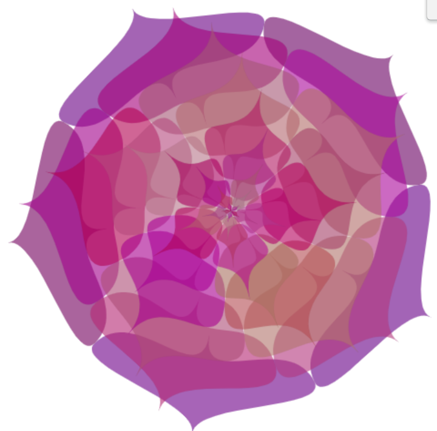

# jili0402_9103_tut5

my first repository for idea9103

This is my first local change to the repo!

# Quiz 8 Design Research-Eternal Blooming
[Introduction to the artist's artwork page](http://www.thibaultpetit.fr/?work=fleurvecto)

## Part 1: Imaging Technique Inspiration
- **Images that inspiring for my assignment** 

- **Discussion** 
1. *which aspect of the example I'd like to incorporate into our project*
   
I love that this work is inspired by a multi-petal flower, which the author designed to unfold from the middle in an infinite cycle and keep blooming.  

The author also used user input to change pattern shapes and animation effects. (ex: let the flowers go from gathering to contracting)

  2. *why I believe it's a beneficial technique*

I think the art of making shapes expand and generate loops is very interesting and it shows the art of generating animation very well. So I believe it can be put into a project.

User input is also mentioned in the main project requirements, and I think it is a good way of interaction.

## Part 2: Coding Technique Exploration
- **Coding technique discussion** 
   - *how this coding technique might help achieve or or contribute to the desired effect*

According author's code, to create a multi-petal flower animation that continuously unfolds from the center. A class named Petale is defined for drawing petals. The Petale class contains methods for drawing the appearance and animation of petals. Some mathematical calculations were also used to determine the position, size and animation of the petals. By adjusting variables like angleInitiale and angleLargeur, the petals expand and contract in a loop, giving the impression of perpetual blooming. User input, such as key presses, toggles features like rotation (rotation variable) or display of reference axes (repere variable), adding interactive elements to the animation. This approach utilizes code-driven animation and real-time adjustments to engage users and create captivating visuals.

- **Images that showcasing the coding technique in action, along with a link to an example implementation** 

[The final generated animation](http://www.thibaultpetit.fr/ressources/flower.php)

**The final generated code unable to link, please by opening the final generate animation link after right-click to check or view the page source*

